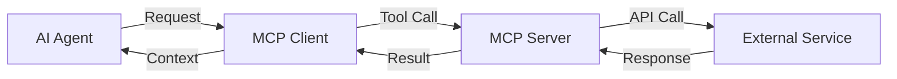

# What is Model Context Protocol (MCP)?

The **Model Context Protocol (MCP)** is an open standard that unifies how AI models communicate with external tools and services. It acts as a bridge between Large Language Models (LLMs) and the real world, enabling AI agents to interact with databases, APIs, files, and other systems in a standardized way.

<Frame>
  
</Frame>

## How MCP Works

MCP follows a simple **client-server architecture**:

- **MCP Client**: The AI assistant or application (like Claude Desktop, Cursor, or your custom AI agent)
- **MCP Server**: A specialized backend that exposes tools to interact with external systems
- **Tools**: Individual functions that the AI can call to perform specific actions



## Key Benefits

<CardGroup cols={2}>
  <Card title="Standardized Integration" icon="arrows-cross">
    One protocol for all external integrations - no more custom, one-off connections
  </Card>
  <Card title="Tool Ecosystem" icon="toolbox">
    Access to 100+ pre-built tools across CRM, productivity, and development platforms
  </Card>
  <Card title="Security & Authentication" icon="shield-check">
    Built-in OAuth flows and secure credential management
  </Card>
  <Card title="Scalable Architecture" icon="chart-line">
    Production-ready hosted infrastructure with self-hosting options
  </Card>
</CardGroup>

## MCP Server Types

### Hosted MCP Servers (Recommended)
Klavis AI provides **production-ready hosted MCP servers** that eliminate setup complexity:

- No infrastructure management
- Built-in OAuth authentication
- Automatic updates and maintenance
- 99.9% uptime SLA

```python
from klavis import Klavis

klavis = Klavis(api_key="your-api-key")
server = klavis.mcp_server.create_server_instance("GMAIL", "user123")
```

### Self-Hosted MCP Servers
For custom requirements or on-premises deployments:

```bash
# Run any MCP server with Docker
docker run -p 5000:5000 ghcr.io/klavis-ai/gmail-mcp-server:latest
```

## Available MCP Integrations

Klavis AI offers 100+ MCP servers across different categories:
<Card title="View All Integrations" icon="list" href="/documentation/mcp-server/overview">
  Browse our complete catalog of MCP server integrations
</Card>

## Getting Started
<CardGroup cols={2}>
  <Card title="Quick Start Guide" icon="rocket" href="/documentation/quickstart">
    Get up and running in under 5 minutes
  </Card>
</CardGroup>

## Learn More

<CardGroup cols={3}>
  <Card title="MCP Official Spec" icon="sparkles" href="https://modelcontextprotocol.io/">
    Read the official Model Context Protocol specification
  </Card>
  <Card title="GitHub Repository" icon="github" href="https://github.com/Klavis-AI/klavis">
    Explore our open-source repo
  </Card>
  <Card title="Community Discord" icon="discord" href="https://discord.gg/p7TuTEcssn">
    Join our developer community
  </Card>
</CardGroup>
